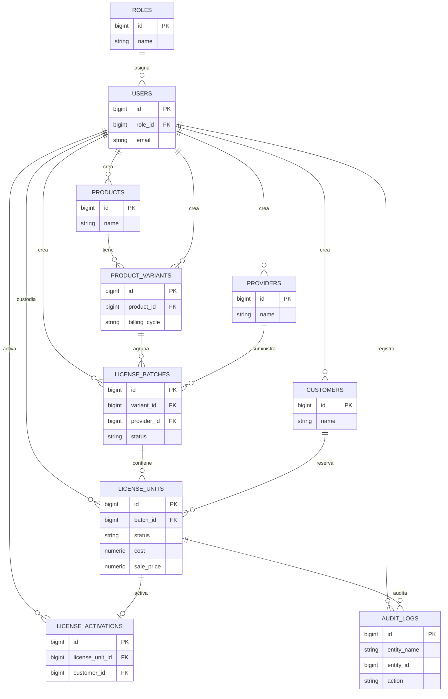

# TrackSaaS

Sistema web administrativo para controlar el inventario, ciclo de vida y activación de licencias de software. Incluye catálogo, lotes, clientes, proveedores, usuarios, roles, activaciones, dashboard financiero-operativo, auditoría y notificaciones.

## Índice

- [Objetivo](#objetivo)
- [Tecnologías](#tecnologías)
- [Arquitectura](#arquitectura)
- [Requisitos previos](#requisitos-previos)
- [Variables de entorno](#variables-de-entorno)
- [Instalación con Docker](#instalación-con-docker)
- [Instalación local opcional](#instalación-local-opcional)
- [Usuarios de demostración](#usuarios-de-demostración)
- [Módulos y endpoints](#módulos-y-endpoints)
- [Reglas de negocio](#reglas-de-negocio)
- [Estados de licencia](#estados-de-licencia)
- [Cálculos financieros](#cálculos-financieros)
- [Semáforo de alertas](#semáforo-de-alertas)
- [Diagrama entidad-relación](#diagrama-entidad-relación)
- [Capturas del sistema](#capturas-del-sistema)
- [Pruebas](#pruebas)
- [Decisiones técnicas](#decisiones-técnicas)
- [Limitaciones conocidas](#limitaciones-conocidas)

## Objetivo

Centralizar el registro y control operativo de licencias: conocer qué se compró, dónde está, quién la custodia, para quién se reservó, cuándo se activó, cuándo vence y qué cambios ocurrieron. El sistema conserva trazabilidad mediante auditoría y evita exponer las claves de licencia en texto plano.

## Tecnologías

| Capa | Tecnología |
|---|---|
| Frontend | React 19, Vite 8, JavaScript, CSS |
| Backend | Node.js, Express 5, CommonJS |
| Base de datos | PostgreSQL 16 en Docker |
| Seguridad | JWT, bcrypt/pgcrypto, Helmet, CORS, rate limit de login |
| Infraestructura | Docker Compose, Nginx 1.27 |
| Pruebas | Node.js built-in test runner, `node:test` |

## Arquitectura

El despliegue Docker usa tres servicios:

```text
Navegador
	|
	v
frontend:80    (Nginx; sirve bundle Vite + proxy /api)
	|
	v
backend:3000   (Express REST; red interna Docker)
	|
	v
postgres:5432  (PostgreSQL + volumen postgres_data)
```

El frontend es la única URL pública del flujo normal. Vite reenvía `/api` al backend y el backend usa `postgres` como hostname interno. Consulta el detalle en [docs/arquitectura.md](docs/arquitectura.md) y [docs/docker.md](docs/docker.md).

## Requisitos previos

Para Docker:

- Docker Desktop con Docker Compose v2.
- Git.
- Puerto libre `80` (frontend Nginx) y `5432` (PostgreSQL opcional para acceso directo).
- Al menos 2 GB de memoria disponible para los contenedores.

Para instalación local opcional:

- Node.js 20 o superior y npm.
- PostgreSQL 15 o superior.
- PowerShell, Bash o terminal compatible.

## Variables de entorno

Docker Compose contiene valores de desarrollo funcionales. En producción se deben reemplazar los secretos.

| Variable | Uso | Ejemplo de desarrollo |
|---|---|---|
| `NODE_ENV` | Entorno de ejecución | `development` |
| `PORT` | Puerto interno del backend | `3000` |
| `DB_HOST` | Host PostgreSQL | `postgres` en Docker |
| `DB_PORT` | Puerto PostgreSQL | `5432` |
| `DB_NAME` | Base de datos | `tracksaas_db` |
| `DB_USER` | Usuario PostgreSQL | `postgres` |
| `DB_PASSWORD` | Contraseña PostgreSQL | `postgres` |
| `JWT_SECRET` | Firma de tokens | Solo desarrollo |
| `JWT_EXPIRES_IN` | Duración JWT | `8h` |
| `LICENSE_ENCRYPTION_KEY` | Cifrado de claves de licencia | Solo desarrollo |
| `CORS_ORIGIN` | Orígenes permitidos | `http://localhost:5173` |
| `JSON_BODY_LIMIT` | Límite JSON | `100kb` |
| `LOGIN_RATE_LIMIT_WINDOW_MS` | Ventana de rate limit | `900000` |
| `LOGIN_RATE_LIMIT_MAX` | Intentos permitidos | `5` |
| `VITE_API_URL` | Base API frontend | `/api` |
| `VITE_API_PROXY_TARGET` | Destino proxy Vite | `http://backend:3000` |

En producción, `JWT_SECRET` y `LICENSE_ENCRYPTION_KEY` deben tener al menos 32 caracteres, ser diferentes y no estar en Git. Genera secretos con:

```bash
node -e "console.log(require('crypto').randomBytes(64).toString('hex'))"
```

## Instalación con Docker

Desde la raíz del repositorio:

```bash
cp .env.example .env
```

Edita `.env` y reemplaza los valores de ejemplo (`DB_PASSWORD`, `JWT_SECRET`, `LICENSE_ENCRYPTION_KEY`) por valores propios antes de un despliegue real. `docker-compose.yml` no contiene credenciales escritas directamente: todas se inyectan desde este archivo, que está excluido del control de versiones (`.gitignore`).

```bash
docker compose up --build -d
docker compose ps
```

Abrir:

```text
http://localhost
```

Comprobar salud:

```bash
docker compose exec backend wget -qO- http://localhost:3000/api/health
docker compose exec backend wget -qO- http://localhost:3000/api/health/db
```

Ver logs:

```bash
docker compose logs -f backend
docker compose logs -f frontend
docker compose logs -f postgres
```

Detener sin borrar datos:

```bash
docker compose down
```

Reinicializar completamente la base de datos demo, destruyendo el volumen:

```bash
docker compose down -v
docker compose up --build -d
```

Los scripts `database/schema.sql` y `database/seed.sql` solo se ejecutan automáticamente cuando PostgreSQL crea un volumen nuevo.

## Instalación local opcional

1. Iniciar PostgreSQL y crear `tracksaas_db`.
2. Ejecutar `database/schema.sql` y después `database/seed.sql`.
3. Instalar dependencias y configurar el backend:

```bash
cd backend
npm install
```

Variables mínimas para backend local:

```env
NODE_ENV=development
PORT=3000
DB_HOST=localhost
DB_PORT=5432
DB_NAME=tracksaas_db
DB_USER=postgres
DB_PASSWORD=postgres
JWT_SECRET=dev-secret-de-al-menos-32-caracteres
JWT_EXPIRES_IN=8h
LICENSE_ENCRYPTION_KEY=dev-license-secret-de-al-menos-32
CORS_ORIGIN=http://localhost:5173
```

Ejecutar backend:

```bash
npm start
```

En otra terminal:

```bash
cd frontend
npm install
npm run dev
```

Para instalación local, configura `VITE_API_URL=http://localhost:3000/api` o usa el proxy definido en `frontend/vite.config.js`.

## Usuarios de demostración

El seed crea estos usuarios:

| Usuario | Contraseña | Rol | Uso |
|---|---|---|---|
| `admin@tracksaas.local` | `Admin123*` | `administrator` | Acceso total |
| `licencias@tracksaas.local` | `Licencias123*` | `license_user` | Operación de licencias |
| `consulta@tracksaas.local` | `Consulta123*` | `viewer` | Consulta |

Son credenciales de demo. Cámbialas antes de cualquier uso real.

## Módulos y endpoints

Base Docker interna/API: `http://localhost:3000/api` desde backend; para el usuario, `http://localhost:5173/api` mediante el proxy frontend.

| Módulo | Endpoints principales |
|---|---|
| Salud | `GET /health`, `GET /health/db` |
| Auth | `POST /auth/login`, `GET /auth/me` |
| Roles | CRUD `/roles` |
| Usuarios | CRUD `/users` |
| Proveedores | CRUD `/providers` |
| Clientes | CRUD `/customers` |
| Productos | CRUD `/products` |
| Variantes | CRUD `/variants` |
| Lotes | CRUD `/batches` |
| Licencias | CRUD `/licenses` |
| Activaciones | `GET /activations`, `GET /activations/:id`, `GET /activations/by-license/:licenseUnitId` |
| Operaciones | `POST /licenses/:id/activate`, `POST /licenses/:id/reserve`, `POST /licenses/:id/release-reservation`, `POST /licenses/expire-overdue` |
| Dashboard | `GET /dashboard/overview` y resúmenes derivados |
| Auditoría | `GET /audit-logs`, `GET /audit-logs/:id` |

Todos los endpoints protegidos requieren `Authorization: Bearer <token>`. La referencia completa está en [docs/api.md](docs/api.md).

## Reglas de negocio

- Solo se registran licencias en lotes `confirmed`.
- La cantidad de licencias registradas no puede superar la cantidad comprada del lote.
- `responsible_user_id` es el custodio inicial; el activador se obtiene del JWT.
- La clave real se cifra y las respuestas solo exponen `masked_code`.
- La activación solo aplica a licencias `available` o `reserved` y solo una vez.
- Una reserva solo aplica a `available`; liberar una reserva devuelve el estado a `available`.
- Los borrados son lógicos: licencias y lotes cancelan estado, otros recursos desactivan `active`.
- `activated` se obtiene por endpoint dedicado, no mediante edición genérica.
- Todas las operaciones sensibles registran auditoría.
- La vigencia depende de `purchase_date` o `first_activation`.

Detalle completo en [docs/reglas-negocio.md](docs/reglas-negocio.md).

## Estados de licencia

| Estado | Significado |
|---|---|
| `available` | Disponible para reservar o activar |
| `reserved` | Apartada para una operación/cliente |
| `activated` | Activación registrada |
| `expired` | Vencida o marcada como expirada |
| `cancelled` | Cancelada, conservada para trazabilidad |

## Cálculos financieros

Los importes se calculan en `backend/src/services/dashboard.service.js`:

```text
Ingresos activados = SUM(sale_price) de licencias activadas
Costo vendido      = SUM(cost) de licencias activadas
Margen estimado    = Ingresos activados - Costo vendido
Inventario         = SUM(cost) de licencias disponibles
Costo mensual      = SUM(cost mensual) + SUM(cost anual / 12)
Proyección anual   = SUM(cost mensual * 12) + SUM(cost anual)
```

Los cálculos excluyen licencias canceladas donde corresponde y usan la moneda almacenada en cada registro.

## Semáforo de alertas

| Color | Regla |
|---|---|
| Verde | Más de 30 días para la fecha crítica |
| Amarillo | Fecha crítica dentro de 30 días |
| Rojo | Fecha crítica vencida o licencia `expired` |

La fecha crítica es `next_renewal_date` (**vencimiento de uso**) si la vigencia ya corre; para licencias físicas aún no activadas se usa `redeem_deadline_date` (**límite de activación/canje**). El motivo se devuelve como `vigencia_en_curso`, `limite_de_canje`, `licencia_vencida` o `sin_fecha_critica`.

## Diagrama entidad-relación



## Pruebas

Backend:

```bash
cd backend
npm install
npm test
```

Docker:

```bash
docker compose up --build -d
```

Frontend:

```bash
cd frontend
npm install
npm run build
npm run lint
```

`npm run lint` puede reportar diagnósticos existentes de React Hooks y `vite.config.js`; el build de producción es el chequeo recomendado para la entrega visual.

Más detalle en [docs/pruebas.md](docs/pruebas.md).

## Decisiones técnicas

- Docker Compose separa base de datos, API y frontend para simplificar despliegue y responsabilidades.
- PostgreSQL concentra integridad referencial, restricciones de estados y cálculos consultables.
- JWT identifica al usuario y evita recibir manualmente el activador en operaciones sensibles.
- Las claves se cifran y se identifican mediante hash para evitar duplicados sin exponer secretos.
- La auditoría es de solo lectura desde la interfaz y registra actor, entidad, acción, fecha e IP.
- Los borrados lógicos preservan trazabilidad histórica.
- Vite mantiene `/api` como ruta única para el frontend, evitando acoplar la interfaz a la URL interna del backend.

## Limitaciones conocidas

- No hay migraciones versionadas; `schema.sql` se aplica al crear un volumen PostgreSQL nuevo.
- Los secretos incluidos en Compose son de desarrollo y deben sustituirse en producción.
- No hay suite E2E ni capturas funcionales versionadas actualmente.
- `npm run lint` conserva diagnósticos técnicos preexistentes que no bloquean `npm run build`.
- No se incluye gestión de recuperación de contraseña, MFA ni integración con proveedores de activación externos.

## Documentación complementaria

```text
docs/
├── arquitectura.md
├── reglas-negocio.md
├── api.md
├── pruebas.md
└── docker.md
```
