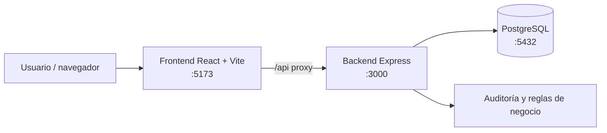

# Arquitectura de TrackSaaS

## Vista general

TrackSaaS usa una arquitectura de tres capas desplegada con Docker Compose:



## Componentes

### Frontend

- React 19 y Vite.
- `frontend/src/App.jsx` controla autenticación, navegación, permisos y notificaciones.
- `frontend/src/components/` contiene dashboard, módulos, tablas, formularios, modales y wizard de licencias.
- `frontend/src/config/modules.js` define módulos, columnas, formularios y permisos usados por la interfaz.
- `frontend/src/App.css` e `index.css` centralizan la identidad visual.

### Backend

- Express expone la API REST bajo `/api`.
- `routes/` registra endpoints.
- `controllers/` traduce HTTP a operaciones de aplicación.
- `services/` contiene reglas de negocio y transacciones.
- `config/` configura PostgreSQL, JWT y seguridad.
- `middlewares/` aplica autenticación, permisos y rate limit.
- `utils/` contiene validaciones, paginación, cifrado y errores.

### Base de datos

PostgreSQL almacena usuarios, roles, catálogo, lotes, licencias, activaciones y auditoría. `database/schema.sql` crea tablas, índices, restricciones y triggers; `database/seed.sql` inserta datos demo.

## Flujo de una solicitud

1. El navegador obtiene un JWT mediante `POST /api/auth/login`.
2. El frontend envía el token como `Authorization: Bearer <token>`.
3. Express valida autenticación y permisos.
4. El servicio ejecuta validaciones y consultas parametrizadas en PostgreSQL.
5. Las operaciones sensibles escriben un registro en `audit_logs`.
6. La API devuelve JSON paginado o el recurso solicitado.

## Red Docker

- `postgres` es accesible para backend mediante `DB_HOST=postgres`.
- `backend` solo se expone dentro de la red Compose mediante `expose: 3000`.
- `frontend` publica `5173` y reenvía `/api` a `http://backend:3000`.
- El volumen `postgres_data` conserva la base entre reinicios.

## Seguridad

- JWT firmado con `JWT_SECRET`.
- Claves de licencia cifradas con `LICENSE_ENCRYPTION_KEY`.
- Hash independiente para detectar claves duplicadas.
- Helmet, CORS configurable, límite JSON y rate limit de login.
- Secretos de producción validados por longitud y diferencia.

## Persistencia y reinicialización

Los scripts de inicialización de PostgreSQL solo corren con un volumen nuevo. Para reconstruir la demo desde cero:

```bash
docker compose down -v
docker compose up --build -d
```
